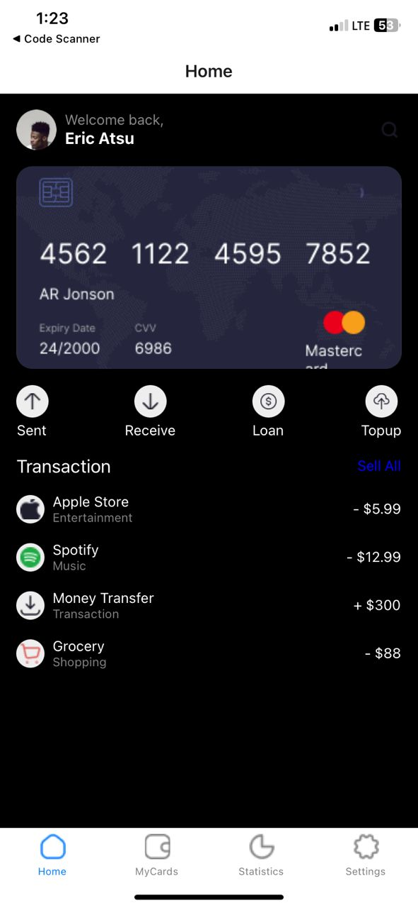
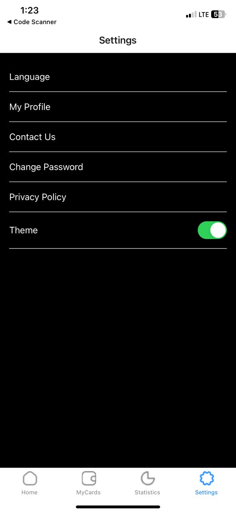
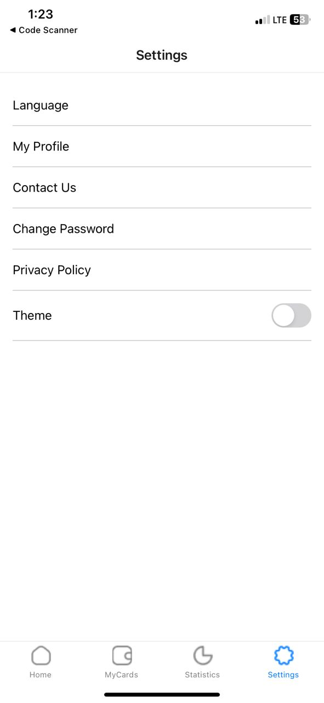

## Mobile App README

# Introduction

This is a mobile app built using React Native, designed to provide a user-friendly interface for managing personal finances. The app allows users to view their card details, transaction history, and switch between light and dark themes.

## Features

# Card details: 
View card number, expiration date, and CVV
Transaction history: View a list of recent transactions, including date, description, and amount
Theme switching: Switch between light and dark themes to customize the app's appearance
Scrollable content: Easily navigate through the app's content using a scrollable interface
Components

# App.js: 
The main app component, responsible for rendering the app's UI
styles.js: A stylesheet containing CSS styles for the app's components
images: A folder containing icons and images used throughout the app
Icons and Images

# The following icons and images are used in the app:

apple.png: Apple logo
spotify.png: Spotify logo
moneyTransfer.png: Money transfer icon
grocery.png: Grocery icon
home.png: Home icon
myCards.png: My cards icon
statistics.png: Statistics icon
settings.png: Settings icon
signal.png: Network signal icon
wifi.png: Wi-Fi signal icon
battery.png: Battery icon
Theme Switching

The app uses a theme switching feature, which allows users to switch between light and dark themes. The theme is stored locally and can be toggled using the switch component in the app's settings.

# Development

To develop and test the app, follow these steps:

Clone the repository to your local machine
Install the required dependencies using npm install or yarn install
Start the app using npx react-native start or yarn react-native start
Open the app in a simulator or physical device using npx react-native run-ios or yarn react-native run-android

## Screenshots:

